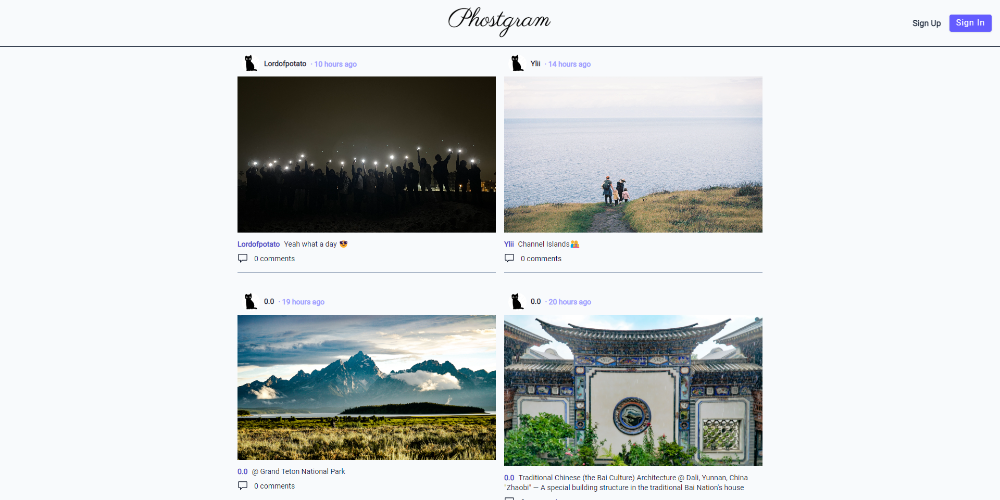

# 

A high quality photos sharing & social media platform

- **Developer**: Boyang (Sean) Xiao
- **Newest realease data**: May 4<sup>th</sup>

**Live site 👉 [Phostgram](https://phostgram.netlify.app/)**
  
---

## Overview

Phostgram is a live full-stack, multi-functioning, web-based social media application, which allows our users to share photos, manage account and enjoy other users' posts. It's somehow like Instagram or Pinterest. BUT!! **Our Phostgram is more pure, more light-weight and most importantly -- WE ARE AD FREEE!!**



### Technical stacks

Phostgram is built on M.E.R.N. stack

- Database: MongoDB
- Backend: Express + Node.js
- Frontend: React + Vite

External services

- MongoDB atlas
- Cloudinary Image hosting

### Features and components

Here are the features we have already released:

- User authentications
- User account management
- Posts (phosts) management

We also got these features under construnctions:

- Phost commenting
- Users following and subspritions
- Phosts contents filtering and sorting

---

## Install and build

We have seperate frontend and backend services. Please build & develop them seperately and deploy them simultaneously.

### Prerequisites

Please apply for these platforms and services before you start:

- [MongoDB atlas](https://www.mongodb.com/cloud/atlas)
- [Cloudinary](https://cloudinary.com/)

Then, create a `.env` file in `./server` directory and fill in the following information:

```shell

# MongoDB atlas
mongoSource= ## altas or local
atlas_mongoURI = <your_mongodb_atlas_cluster_URL>
local_mongoURI = <your_local_mongodb_URL>

# Cloudinary
CLOUDINARY_CLOUD_NAME = <your_cloudinary_cloud_name>
CLOUDINARY_API_KEY= <your_cloudinary_api_key>
CLOUDINARY_API_SECRET = <your_cloudinary_api_secret>

```

### Backend

Install dependencies

```shell
cd ./server
npm install
```

Start services

```shell
npm run start
```

Develop and debug services

```shell
npm run dev
```

### Frontend

Install dependencies

```shell
cd ./client
npm install
```

Compile and build

```shell
npm run build
## Deployment dir should be prepared as "./dist"
```

Start services

```shell
npm run start
```

Develop and debug services

```shell
npm run dev
```

---

## API documentations

We defined a set of REST APIs for the communication between frontend and backend services.

Visit here 👉 [API documentations](./doc/API.md)

---

## Contribution Instructions

We appreciate your interest in contributing. To make the process as smooth as possible, please follow these instructions:

### Submitting an Issue

If you encounter a bug or have a feature request, please submit an issue to our issue tracker. Before submitting an issue, please search existing issues to see if your problem or request has already been reported.

When submitting an issue, please include as much information as possible, such as steps to reproduce the problem or a detailed description of the requested feature. Screenshots or code snippets are also helpful.

### Making a Contribution

To make a contribution to our project, please follow these steps:

1. Fork our repository to your own GitHub account.
2. Clone the forked repository to your local machine.
3. Create a new branch for your changes: git checkout -b my-new-branch.
4. Make your changes to the code or documentation.
5. Test your changes to ensure that they work as intended.
6. Commit your changes with a descriptive commit message: git commit -m "Add new feature".
7. Push your changes to your forked repository: git push origin my-new-branch.
8. Submit a pull request to our repository.

Please make sure that your pull request includes a detailed description of your changes and why they are necessary. Also, please ensure that your changes are consistent with our coding style and guidelines.

Thank you for your contribution!


